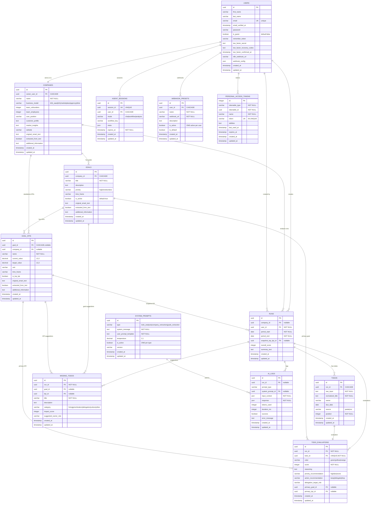

# Axia - AI Focus Coach for Early-Stage Founders

Axia is an AI-powered focus coach that helps early-stage founders prioritize their to-do lists based on their business goals and KPIs. It analyzes tasks, provides impact scores, and suggests what to prioritize, delegate, or drop.

## ⚡ Recent Updates

### System Prompt Security Fix (2025-11-25)

🔒 **Critical Security Enhancement**: Implemented multi-layer protection to prevent unauthorized deletion or modification of system prompts. Guest users can no longer delete essential AI prompts. See [SYSTEM_PROMPT_SECURITY.md](SYSTEM_PROMPT_SECURITY.md) for details.

**Key Changes:**

-   Added `is_system_default` flag to system prompts
-   Enhanced AdminPrompts component with deletion/edit protection
-   Created `system:restore-prompts` artisan command for recovery
-   Strengthened authentication checks for admin routes

## Features

-   **Smart Task Analysis**: AI-powered evaluation of tasks against your goals and KPIs
-   **Focus Reports**: Visual, color-coded task rankings with actionable recommendations
-   **Goal & KPI Management**: Define objectives and track key performance indicators
-   **Guest Mode**: Try the app without creating an account
-   **CSV Support**: Upload task lists or export results as CSV
-   **Mobile-First Design**: Responsive, Airbnb-inspired UI

## Tech Stack

-   **Backend**: Laravel 12, Livewire, Fortify
-   **Frontend**: Tailwind CSS 4, Alpine.js (via Livewire)
-   **Database**: SQLite (dev), PostgreSQL (production ready)
-   **AI**: n8n Webhooks → OpenAI GPT-4 (see [WEBHOOK_AI_ARCHITECTURE.md](WEBHOOK_AI_ARCHITECTURE.md))

## Quick Start (Docker)

```bash
# 1. Clone repository
git clone https://github.com/habibidani/axia.git
cd axia

# 2. Environment setup
cp .env.example .env
docker compose run --rm php-cli php artisan key:generate

# 3. Start containers
docker compose up -d

# 4. Install dependencies
docker compose exec php-cli composer install

# 5. Run migrations
docker compose exec php-cli php artisan migrate --seed

# 6. Open app
open http://localhost
```

## Development Setup

For detailed development instructions including n8n setup, MCP servers, and debugging, see [DEV_SETUP.md](DEV_SETUP.md).

**Key services:**

-   Laravel: http://localhost
-   n8n: http://localhost:5678 (via `docker-compose.n8n.yaml`)
-   PostgreSQL: localhost:5432

## Usage

1. **Login**: Visit `/login` and enter your email (or continue as guest)
2. **Setup**: Add company info and define your goals & KPIs
3. **Analyze**: Paste your to-do list on the home screen
4. **Review**: Get a focus report with task rankings and missing high-impact tasks
5. **Export**: Download results as CSV

## Backend Architecture

### Database Schema



**Key Relationships:**

-   👤 **User → Company**: 1:1 ownership
-   🎯 **Company → Goals**: One company has many goals
-   📊 **Goal → KPIs**: Goals track multiple KPIs (or standalone company KPIs)
-   🔄 **Run**: Analysis session linking user, company, todos, and AI evaluations
-   ✅ **Todo → Evaluation**: Each todo gets one AI evaluation (1:1)
-   💡 **Missing Todos**: AI-suggested tasks per run based on goals/KPIs
-   🤖 **System Prompts**: Versioned AI prompts (one active per type)
-   📝 **AI Logs**: Complete audit trail of all AI operations
-   🔗 **Webhook Presets**: User-specific n8n webhook configs (one active)
-   🎭 **Agent Sessions**: Temporary session storage for n8n agents### Service Architecture


### Test Coverage

**Comprehensive Test Suite** (84 tests passing):

-   ✅ Model CRUD Operations (all 12 models)
-   ✅ Relationship Tests (14 relationship groups)
-   ✅ Business Logic (webhook activation, KPI calculations, scoring)
-   ✅ Service Integration (WebhookAiService, UserContextService)
-   ✅ Cascade Deletes & Constraints

**Run Tests:**

```bash
# All tests
./run-tests.ps1

# Specific suite
./test-quick.ps1 relationships
./test-quick.ps1 business
./test-quick.ps1 services
```

**Test Database:** PostgreSQL `axia_test` (separate from dev database)

## AI Architecture

All AI processing is handled via n8n webhooks. No direct OpenAI API calls from Laravel.

See [WEBHOOK_AI_ARCHITECTURE.md](WEBHOOK_AI_ARCHITECTURE.md) for complete documentation.

**Key Service**: `app/Services/WebhookAiService.php`

## Routes

-   `/` - Redirects to login
-   `/login` - Login/guest access
-   `/home` - Main dashboard
-   `/company/edit` - Edit company info
-   `/goals/edit` - Manage goals & KPIs
-   `/results/{run}` - View focus report

## Development

Run all services concurrently:

```bash
composer run dev
```

This starts:

-   Laravel development server
-   Queue worker
-   Log viewer (Pail)
-   Vite dev server with hot reload

## Testing

```bash
composer test
```

## n8n Integration via MCP Server

Axia provides a Model Context Protocol (MCP) server that wraps the REST API, making it easy to integrate with n8n AI agents.

### MCP Server Features

The Axia MCP server exposes the following **tools**:

-   `get_user` - Get current user profile and company
-   `get_goals` - List all goals with KPIs
-   `create_goal` - Create a new business goal
-   `get_runs` - Get analysis runs with filtering
-   `create_todos` - Create todos and run AI analysis
-   `analyze_todos` - Get detailed AI recommendations

And **resources**:

-   `axia://user` - Current user profile (JSON)
-   `axia://goals` - All goals with KPIs (JSON)
-   `axia://runs/recent` - 10 most recent runs (JSON)

### Setup

1. **Create API Token**:

```bash
docker compose exec php-cli php artisan tinker
>>> $token = \App\Models\User::first()->createToken('n8n-mcp-server');
>>> echo $token->plainTextToken;
```

2. **Configure Environment**:
   Add the token to `.env`:

```
AXIA_API_TOKEN=1|your-generated-token-here
```

3. **Start MCP Server**:

```bash
docker compose -f docker-compose.n8n.yaml up -d mcp-axia
```

4. **Configure in n8n**:
   Add MCP server URL in n8n settings:

```
http://mcp-axia:8102/sse-axia
```

5. **Use in n8n Workflows**:
   The Axia tools will be available in n8n AI Agent nodes. Example:

-   Ask: "What are my current business goals?"
-   Agent calls: `get_goals` tool
-   Result: Formatted list with KPIs

### MCP Server Architecture

```
n8n → supergateway (SSE) → Axia MCP Server → Laravel API (Sanctum)
```

-   **Transport**: Server-Sent Events (SSE) via supergateway
-   **Authentication**: Sanctum Bearer token (transparent to n8n)
-   **Port**: 8102 (SSE endpoint: `/sse-axia`)
-   **Networks**: n8n-network + axia-shared-network

### Example Usage in n8n

**Scenario**: Create todos and get AI analysis

```javascript
// In n8n AI Agent:
"Create these todos for goal X: [list]"

// MCP server calls:
1. create_todos({ goal_id: "X", todos: [...], analyze: true })
2. Returns analysis with impact scores and recommendations
```

For more details, see the [full API documentation](API_DOCS.md).

## License

MIT
